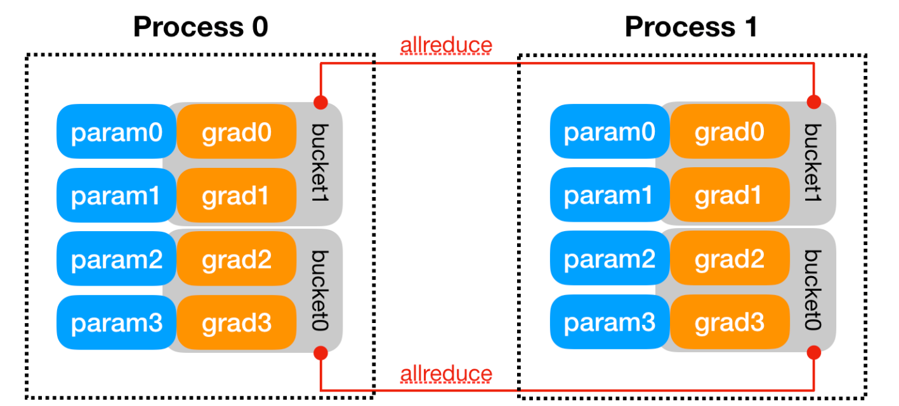

# EfficientDDP-4-Contrastive-Train
Optimizing the way of contrastive learning in PyTorch-DDP(DistributedDataParallel) multi-GPU training

* Transforming similarity calculation from [global, global] to [local, global]
* Addressing gradient issues in distributed calculation
* Aligning ground truth positions of local similarity matrix


## Project structure

```python
EfficientDDP-4-Contrastive-Train/
│
├── ED4CT/
│   ├── __init__.py
│   ├── AllGather.py
│   └── LossFunc.py
│
├── .gitignore
├── examples.py # toy examples to facilitate your understanding
├── LICENSE
└── README.md
```


## Where you can use it?

Your own contrastive learning pre-train or fine-tune project, using DDP to accelerate, architectures like [CLIP](https://openai.com/blog/clip/), [ALIGN](https://arxiv.org/abs/2102.05918).


## How to use it?

```python
# examlpe for training CLIP-LIKE models

import torch
import torch.distributed as dist
from ED4CT import AllGather
from ED4CT.LossFunc import CrossEntropy 

# ...
# dist.init_process_group(
#     backend='nccl',
#     rank=rank,
#     world_size=world_size,
# )
#
# model = nn.parallel.DistributedDataParallel(model, device_id) 
# ...

# your definition of model.forward()
def forward():
    # ...preprocess before calculating similarity matrix, just like non-distributed training
    # Now we get two features to calculate similarity matrix: features1 and features2
    # features1 and features2 will be shaped in [local_batch_size, feature_size]
	
    # suppose you only use DDP in training
    if self.training and self.task_conf.n_gpus > 1:
        # get all tensor from all GPU 
        # the shape of all_feature is [global_batch_size, feature_size]
        all_feature1 = AllGather(feature1)
        all_feature2 = AllGather(feature2)

        # the shape of sim_matrix is [local_batch_size, global_batch_size]
        sim_matrix1 = temperature * torch.matmul(feature1, all_feature2.t())
        sim_matrix2 = temperature * torch.matmul(feature2, all_feature1.t())

        # get ground truth position (the diagonal line's 1st element) of local data
        # align local ground truth
        ground_truth_pos = self.task_conf.global_batch_size / self.task_conf.n_gpus * dist.get_rank()

        loss1 = CrossEntropy(sim_matrix1, ground_truth_pos)
        loss2 = CrossEntropy(sim_matrix2, ground_truth_pos)

        loss = (loss1 + loss2) / 2
        
        return loss
```


## Simple theoretical analysis

The content below is not necessary for project deployment, just for deeper discussing about the reasoning process and motivations.


### Why contrastive learning is slightly complex in DDP?

We mainly discuss about two things and their interaction for this section:

* Separable and Non-separable Loss
* Pytorch's mechanism of distributed gradient calculation——gradient bucket


#### Separable and Non-separable Loss

In a distributed computing environment, the computation of loss functions that are separable can be performed locally on each GPU(e.g. cross entropy). This local computation covers the entire loss calculation for every single sample, allowing for an end-to-end loss evaluation within the local context of each processing unit. Subsequently, the average gradient across all parameters that require gradient computation is obtained via a bucketing mechanism, calculating loss which is representative of batch level.

Contrastingly, in the domain of contrastive learning under distributed data parallel (DDP), loss functions that are Non-separable by nature cannot be computed in isolation on individual GPUs to yield a complete loss calculation. 

For instance, in contrastive learning using NCE-Loss, the loss value for each sample is computed by contrasting it with all negative samples. In other words, we need all samples in a batch to obtain the same contrastive loss as in the non-distributed scenario, but we only have part of samples locally in DDP. Only by using "all_gather" behavior to gather all negative samples for samples in local GPU can we obtain the correct contrastive loss for each sample.
$$
\mathcal{L}_{\text{NCE}} = -\log\left(\frac{sim(pos\_pairs)}{sim(pos\_pairs) + \sum_{k=1}^{K} sim(neg\_pairs)}\right)
$$
Here's an awesome blog that talks about the same topic: [Separable and Non-separable Loss in detail](https://amsword.medium.com/gradient-backpropagation-with-torch-distributed-all-gather-9f3941a381f8)

So global context in such loss functions necessitates a collective communication pattern. We can use distributed communication function like all_gather to meet our expectations, it's worth noting that the all_gather function does not return gradient values upon completion. Solutions for this are discussed in the above-mentioned blog post. A naive way is do global calculation after we get final feature in each GPU:

```python
CODE BLOCK 1

import torch
import torch.distributed as dist

# ...in every GPU

all_feature1 = [torch.zeros_like(feature1) for i in range(dist.get_world_size())]
dist.all_gather(all_feature1, feature1)
all_feature1[dist.get_rank()] = feature1 # require_grad for local sample
all_feature2 = [torch.zeros_like(feature2) for i in range(dist.get_world_size())]
dist.all_gather(all_feature2, feature1)
all_feature2[dist.get_rank()] = feature2

# similarity matrix for loss, the diagonal line is the results of pos_pairs
# sim_matrix shape: [global, global]
sim_matrix = torch.matmul(all_feature1, all_feature2.t())

loss = (loss_fun(sim_matrix) + loss_fun(sim_matrix.T)) / 2
```


In this way, i get my model converge correctly like non-distributed-training. However, we do much redundant calculation on all GPU, we expect more data efficiency with more process 'distributed', is there some optimization to solve it? With some modification, we can code below;

```python
CODE BLOCK 2

import torch
import torch.distributed as dist

# ...in every GPU

all_feature1 = [torch.zeros_like(feature1) for i in range(dist.get_world_size())]
dist.all_gather(all_feature1, feature1)
all_feature1[dist.get_rank()] = feature1
all_feature2 = [torch.zeros_like(feature2) for i in range(dist.get_world_size())]
dist.all_gather(all_feature2, feature1)
all_feature2[dist.get_rank()] = feature2

# change calculation size from [global, global] to [local, global]
sim_matrix1 = torch.matmul(feature1, all_feature2.t())
sim_matrix2 = torch.matmul(feature2, all_feature1.t())

loss = (loss_fun(sim_matrix1) + loss_fun(sim_matrix2)) / 2
```


I have each GPU compute only the local positive samples compared to global negative samples, which enhances distributed computing efficiency and ensures the correctness of each sample's loss calculation.

If the story ends now, this repository will no longer have a purpose. When i use it in some DDP contrastive fine-tune work, the model can not converge anymore.

> Premature optimization is the root of all evil.                                    										---Donald Knuth

The loss is calculated correctly through my analysis, so, let's dig deeper in Pytorch's gradient mechanism in DDP.


#### gradient bucket

Gradient bucket is a method used by DDP (DistributedDataParallel) to synchronize gradients between different processes. Detailed explanations can be found on the official PyTorch website. The following content is excerpted from the official website at https://pytorch.org/docs/stable/notes/ddp.html#internal-design:

> **Backward Pass**: The `backward()` function is directly invoked on the loss `Tensor`, which is out of DDP’s control, and DDP uses autograd hooks registered at construction time to trigger gradients synchronizations. When one gradient becomes ready, its corresponding DDP hook on that grad accumulator will fire, and DDP will then mark that parameter gradient as ready for reduction. When gradients in one bucket are all ready, the `Reducer` kicks off an asynchronous `allreduce` on that bucket to calculate mean of gradients across all processes. When all buckets are ready, the `Reducer` will block waiting for all `allreduce` operations to finish. When this is done, averaged gradients are written to the `param.grad` field of all parameters. So after the backward pass, the grad field on the same corresponding parameter across different DDP processes should be the same.




In simple terms, the gradient bucket mechanism ensures that after each process computes gradients for their respective parameters, an all_reduce operation is performed on all gradients within each bucket to synchronize them by taking the mean. This default behavior is expected to yield the same gradient for each parameter as non-distributed computation.

However, when gradient bucket meets a non-separable loss, the situation becomes more interesting.


#### Contrastive learning gradient discrepancies: with vs. without DDP

Let's see gradient behaviors in CODE BLOCK 1 and CODE BLOCK 2, what differences in them that cause wrong result in my optimization. Use some mathematical analysis:


### How to design "gather" backward function consistent with the gradient backward behavior of global computation?


### Implementation: all_reduce vs. reduce_scatter?

Which is actually do trade-off between computation-cost and distributed-communication-cost


## Version history

```
**Version 0.1.0 (December 28, 2023)**
- Initial src

TODO:
- finish theoretical analysis
_ finish example_one in example.py
```


## Acknowledgements

Heuristic thoughts and discussions from PyTorch forum and openai/CLIP issues and comments.

Motivated by https://github.com/openai/CLIP/issues/132#issuecomment-908004353, deeply grateful to @jongwook for his generous and patient responses regarding implementation details in CLIP training.

