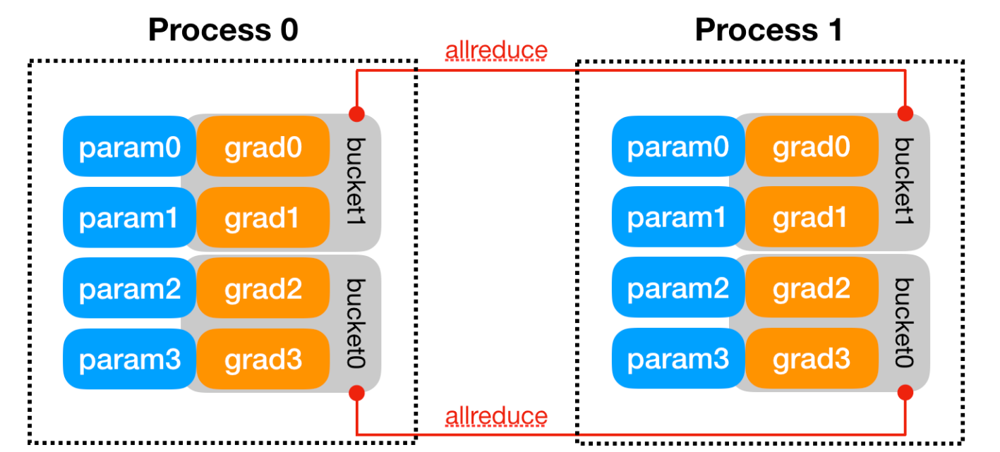
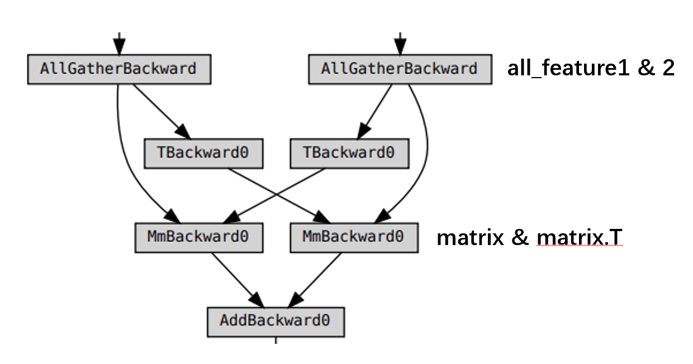
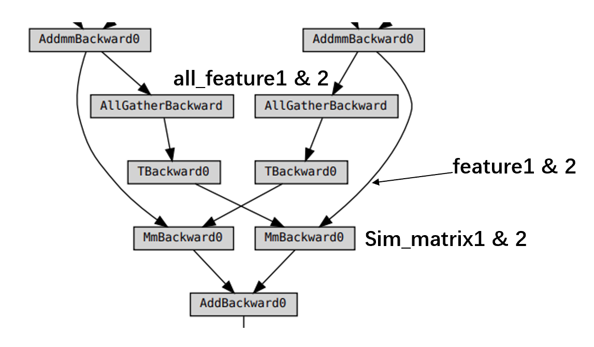
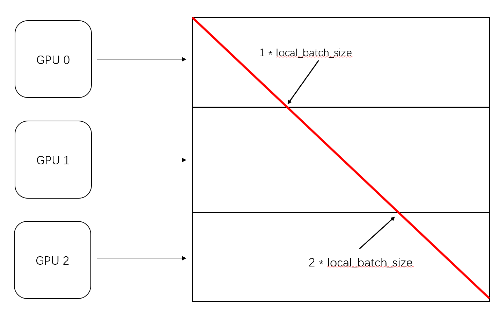

# EfficientDDP-4-Contrastive-Train

Optimizing the way of contrastive learning in PyTorch-DDP(DistributedDataParallel) multi-GPU training

* Transforming similarity calculation from [global, global] to [local, global]

  e.g. Many implementations are using former way, such as [SimCLR](https://github.com/Spijkervet/SimCLR/blob/master/simclr/modules/nt_xent.py#L36), [essl](https://github.com/rdangovs/essl/blob/main/imagenet/simclr/main.py#L232)
* Addressing gradient issues in distributed calculation
* Aligning ground truth positions of local similarity matrix


## Project structure

```python
EfficientDDP-4-Contrastive-Train/
│
├── ED4CT/
│   ├── __init__.py
│   ├── AllGather.py
│   └── LossFunc.py
│
├── .gitignore
├── examples.py # toy examples to facilitate your understanding
├── LICENSE
└── README.md
```


## Where you can use it?

Your own contrastive learning pre-train or fine-tune project, using DDP to accelerate, architectures like [CLIP](https://openai.com/blog/clip/), [ALIGN](https://arxiv.org/abs/2102.05918).


## How to use it?

```python
# examlpe for training CLIP-LIKE models

import torch
import torch.distributed as dist
from ED4CT import AllGather
from ED4CT.LossFunc import CrossEntropy 
AllGather = AllGather.apply

# ...
# dist.init_process_group(
#     backend='nccl',
#     rank=rank,
#     world_size=world_size,
# )
#
# model = nn.parallel.DistributedDataParallel(model, device_id) 
# ...

# your definition of model.forward()
def forward():
    # ...preprocess before calculating similarity matrix, just like non-distributed training
    # Now we get two features to calculate similarity matrix: features1 and features2
    # features1 and features2 will be shaped in [local_batch_size, feature_size]
	
    # suppose you only use DDP in training
    if self.training and self.task_conf.n_gpus > 1:
        # get all tensor from all GPU 
        # the shape of all_feature is [global_batch_size, feature_size]
        # class args have the member: rank, world_size 
        all_feature1 = AllGather(feature1, args)
        all_feature2 = AllGather(feature2, args)

        # the shape of sim_matrix is [local_batch_size, global_batch_size]
        sim_matrix1 = temperature * torch.matmul(feature1, all_feature2.t())
        sim_matrix2 = temperature * torch.matmul(feature2, all_feature1.t())

        # get ground truth position (the diagonal line's 1st element) of local data
        # align local ground truth
        ground_truth_pos = self.task_conf.global_batch_size / self.task_conf.n_gpus * dist.get_rank()

        loss1 = CrossEntropy(sim_matrix1, ground_truth_pos)
        loss2 = CrossEntropy(sim_matrix2, ground_truth_pos)

        loss = (loss1 + loss2) / 2
        
        return loss
```


## Simple theoretical analysis

The content below is not necessary for project deployment, just for deeper discussing about the reasoning process and motivations.


### Why contrastive learning is slightly complex in DDP?

We mainly discuss about two things and their interaction for this section:

* Separable and Non-separable Loss
* Pytorch's mechanism of distributed gradient calculation——gradient bucket


#### Separable and Non-separable Loss

In a distributed computing environment, the computation of loss functions that are separable can be performed locally on each GPU(e.g. cross entropy). This local computation covers the entire loss calculation for every single sample, allowing for an end-to-end loss evaluation within the local context of each processing unit. Subsequently, the average gradient across all parameters that require gradient computation is obtained via a bucketing mechanism, calculating loss which is representative of batch level.

Contrastingly, in the domain of contrastive learning under distributed data parallel (DDP), loss functions that are Non-separable by nature cannot be computed in isolation on individual GPUs to yield a complete loss calculation. 

For instance, in contrastive learning using NCE-Loss, the loss value for each sample is computed by contrasting it with all negative samples. In other words, we need all samples in a batch to obtain the same contrastive loss as in the non-distributed scenario, but we only have part of samples locally in DDP. Only by using "all_gather" behavior to gather all negative samples for samples in local GPU can we obtain the correct contrastive loss for each sample.

<p align="center">

</p>


Here's an awesome blog that talks about the same topic: [Separable and Non-separable Loss in detail](https://amsword.medium.com/gradient-backpropagation-with-torch-distributed-all-gather-9f3941a381f8)

So global context in such loss functions necessitates a collective communication pattern. We can use distributed communication function like all_gather to meet our expectations, it's worth noting that the all_gather function does not return gradient values upon completion. Solutions for this are discussed in the above-mentioned blog post. A naive way is do global calculation after we get final feature in each GPU:

```python
CODE BLOCK 1

import torch
import torch.distributed as dist

# ...in every GPU

all_feature1 = [torch.zeros_like(feature1) for i in range(dist.get_world_size())]
dist.all_gather(all_feature1, feature1)
all_feature1[dist.get_rank()] = feature1 # require_grad for local sample
all_feature2 = [torch.zeros_like(feature2) for i in range(dist.get_world_size())]
dist.all_gather(all_feature2, feature1)
all_feature2[dist.get_rank()] = feature2

# similarity matrix for loss, the diagonal line is the results of pos_pairs
# sim_matrix shape: [global, global]
sim_matrix = torch.matmul(all_feature1, all_feature2.t())

loss = (loss_fun(sim_matrix) + loss_fun(sim_matrix.T)) / 2
```


In this way, i get my model converge correctly like non-distributed-training. However, we do much redundant calculation on all GPU, we expect more data efficiency with more process 'distributed', is there some optimization to solve it? With some modification, we can code below;

```python
CODE BLOCK 2

import torch
import torch.distributed as dist

# ...in every GPU

all_feature1 = [torch.zeros_like(feature1) for i in range(dist.get_world_size())]
dist.all_gather(all_feature1, feature1)
all_feature1[dist.get_rank()] = feature1
all_feature2 = [torch.zeros_like(feature2) for i in range(dist.get_world_size())]
dist.all_gather(all_feature2, feature1)
all_feature2[dist.get_rank()] = feature2

# change calculation size from [global, global] to [local, global]
sim_matrix1 = torch.matmul(feature1, all_feature2.t())
sim_matrix2 = torch.matmul(feature2, all_feature1.t())

loss = (loss_fun(sim_matrix1) + loss_fun(sim_matrix2)) / 2
```


I have each GPU compute only the local positive samples compared to global negative samples, which enhances distributed computing efficiency and ensures the correctness of each sample's loss calculation.

If the story ends now, this repository will no longer have a purpose. When i use it in some DDP contrastive fine-tune work, the model can not converge anymore.

> Premature optimization is the root of all evil.                                    										---Donald Knuth

The loss is calculated correctly through my analysis, so, let's dig deeper in Pytorch's gradient mechanism in DDP.


#### gradient bucket

Gradient bucket is a method used by DDP (DistributedDataParallel) to synchronize gradients between different processes. Detailed explanations can be found on the official PyTorch website. The following content is excerpted from the official website at https://pytorch.org/docs/stable/notes/ddp.html#internal-design:

> **Backward Pass**: The `backward()` function is directly invoked on the loss `Tensor`, which is out of DDP’s control, and DDP uses autograd hooks registered at construction time to trigger gradients synchronizations. When one gradient becomes ready, its corresponding DDP hook on that grad accumulator will fire, and DDP will then mark that parameter gradient as ready for reduction. When gradients in one bucket are all ready, the `Reducer` kicks off an asynchronous `allreduce` on that bucket to calculate mean of gradients across all processes. When all buckets are ready, the `Reducer` will block waiting for all `allreduce` operations to finish. When this is done, averaged gradients are written to the `param.grad` field of all parameters. So after the backward pass, the grad field on the same corresponding parameter across different DDP processes should be the same.




In simple terms, the gradient bucket mechanism ensures that after each process computes gradients for their respective parameters, an all_reduce operation is performed on all gradients within each bucket to synchronize them by taking the **mean**. This default behavior is expected to yield the same gradient for each parameter as non-distributed computation.

However, when gradient bucket meets a non-separable loss, the situation becomes more interesting.


#### Contrastive learning gradient discrepancies: global*global vs. local\*global

Let's see gradient behaviors in CODE BLOCK 1 and CODE BLOCK 2, what differences in them that cause wrong result in my optimization. Use some mathematical analysis:

* For CODE BLOCK 1 ---- global * global

Here's a partial illustrative (not identical to code) computation graph to show the process of "compute the similarity matrix"



In deep learning, the backward propagation of gradients follows the chain rule, which means that every non-leaf node on the computation graph needs to compute gradients and propagate them backward towards the leaf nodes from the loss. In other words, gradients calculated for tensors at a certain computation step will propagate forward through the graph.

Let's focus on `all_feature1`, `grad_input` as the gradient passed to the previous computation node, and `grad_output` as the gradient received from the next computation node, the gradients obtained for each `all_feature1` tensor in the step of calculating `sim_matrix` are:

<p align="center">

</p>


<p align="center">

</p>

<p align="center">

</p>
	


Since `all_feature2` is consistent across all GPUs, the gradient calculation in current step, when performed backward, will be multiplied by the **same tensor** `all_feature2` on all GPUs. Ultimately, under the DDP's gradient bucket mechanism, the same result as non-distributed computation is obtained.

(Let me add a little more reasoning detail, because, after the 'all gather' operation, every GPU's computational behavior becomes identical to non-distributed computing, and the gradients on all GPUs in backward before reaching the 'all gather' operation are the same. In terms of the chain rule, this manifests as each GPU's gradient computation chain having the **same portion** before 'all gather.' Therefore, the common part of these GPU's gradients can be factored out. The remaining gradients in the gradient bucket will be summed and averaged at the end, making formula of gradient chain **equivalent to** the gradient backward computation in **non-distributed** training.)

So, that's why CODE BLOCK 1 worked.


* For CODE BLOCK 2 ---- local * global



Similarly to the previous scenario, it is easy to see that the gradients of `feature1` and `feature2` are the same in the computations across all GPUs because they are multiplied by the same `all_feature1` and `all_feature2` in the matrix multiplication. Let's focus on the gradient computation of one `all_feature` . Using  $feature_i$  to represent the feature computed on the i-th GPU. Assuming the same symbols as in the previous case:


<p align="center">

</p>

The gradient of all_feature is not identical to each other on GPU any more.

In this situation, we can get a leaf node's gradient on one of ith GPU before the computation, note that we only focus on the influence of all_feature's gradient:

<p align="center">

</p>

`same_priror_i` means on the ith GPU, the average gradient with data after all gather function. As we know the gradient bucket will do average at the end of the gradient calculation, we get the behavior in **CODE BLOCK 2**:

<p align="center">

</p>

But in original **non-distributed** situation, consider that divide batch samples in n_gpu chunks to construct a similar mathematical structure. Though we don't have $feature_i$ in **non-distributed** situation, we know feature_i is actually the slice of all_feature, so we can utilize the full derivative formula: $f'(all\\_feature)=\sum feature_i$ . Remember, we use `mean` on every sample to get batch-level loss in all situation nonetheless globally or locally:

<p align="center">

</p>

Two equations are apparently different in connection between $feature$ and $diff\\_subsequent$.


**Summarizing the mathematical reasoning above, we arrive at an important conclusion: in non-distributed computation, the summation of each `feature_i` has a common impact on the subsequent global gradients. This is different from the behavior of the gradient bucket in CODE BLOCK 2, where each `feature_i` essentially only affects the local gradient. Therefore, with mathematical analysis, the final averaging behavior in the bucket is not equivalent to the behavior in non-distributed computing.**

The backward method of all gather behavior in CODE BLOCK 2 can be described as follows, note that backward behavior is the same as CODE  BLOCK 1, but the value of gradient is slightly different:
```python
all_gather_backward(grad_output):
    # naive 'scatter' to fit shape of input tensor in the forward process
    grad_input = grad_output[local_batch_size * rank: local_batch_size * (ctx.rank + 1)]
    # unlike CODE BLOCK 1, now the values of grad_output on each GPU are no longer the
    # same. This slicing approach neglects a significant portion of unused gradient, causing divergence.    
    
    return grad_input
```


Reviewing the earlier discussion on separable and non-separable cases, due to the calculation of the non-separable loss involving a global data gather operation, when propagating gradients backward, we cannot only consider local gradients but must also take into account global gradients by summation (in accordance with the mathematical definition of full derivatives). 


So, we need to customize the backward behavior in all gather function using `torch.autograd.Function`.


### How to design "gather" backward function consistent with the gradient backward behavior of global computation?

At first, showing the result:

```python
# With optimizing your similarity matrix result from [global, global] to [local, global]
class AllGather(torch.autograd.Function):

    @staticmethod
    def forward(ctx, tensor, args):
        output = [torch.empty_like(tensor) for _ in range(args.world_size)]
        dist.all_gather(output, tensor)
        ctx.rank = args.rank
        ctx.local_batch_size = tensor.shape[0]
        return torch.cat(output, dim=0)

    @staticmethod
    def backward(ctx, grad_output):
        # Reduce gradients prior to gradient bucket to avoid behavior mismatches with non-distributed training
        dist.all_reduce(grad_output, op=dist.ReduceOp.SUM)

        return (
            grad_output[ctx.local_batch_size * ctx.rank: ctx.local_batch_size * (rank + 1)],
            None,
        )
```
When i use it on my experiment which diverges on CODE BLOCK 2 version of all gather, the model can converge as normal.

Overloading `torch.autograd.Function` allows us to customize the forward and backward behavior of our function. The forward operation, without further explanation, aggregates tensors from all GPUs into one tensor.

In the backward operation, based on mathematical reasoning, we need to manually reduce all gradients here in a summation manner, rather than waiting for gradient synchronization by the gradient bucket. This step ensures equivalence with the behavior of non-distributed training.

Observing the return values in `backward`, the elements of the tuple correspond to the gradients of the `tensor` and `args` in the `forward`. As we all know, the propagation process of forward and backward is entirely a forward and reverse process in terms of element shapes.

The first element of the return value can be operationally referred to as 'scatter' in distributed operations, which means splitting a computation result into different blocks and distributing them to different distributed nodes. The backward process seems like 'reduce + scatter'. So, why I choose to perform a all reduce operation on all nodes instead of using the 'reduce_scatter' operation on single node and only use single function globally?

* all_reduce


* reduce_scatter


image source: [Collective Operations — NCCL 2.19.3 documentation (nvidia.com)](https://docs.nvidia.com/deeplearning/nccl/user-guide/docs/usage/collectives.html)


### Implementation: all_reduce vs. reduce_scatter?

Which is actually do trade-off between computation-cost and distributed-communication-cost. Though i don't have a huge distributed system enough to verify it, i can give some naive analysis.

* Using all reduce, we do not need another communication operation among all nodes and only do matrix slicing locally, which achieves both balanced computation time and minimize additional communication operations as much as possible. But it will enlarge computation cost in global view.
*  Using reduce scatter, means only one node need to do all the scatter work, other nodes will wait for data. This will cause intervals in GPU running, one node will do many more jobs and more communication operations will be executed.


### A simple way to align local ground truth element in sim_matrix

In the previous discussion, we learned that each GPU actually computes a portion of the global similarity matrix locally, more precisely, it is a subset of rows in the similarity matrix. In the loss function of contrastive learning, it is usually necessary to specify ground truth samples, which in the global similarity matrix correspond to the diagonal elements, i.e., positive pairs.

So from the image below, we can see that the positive pairs computed locally by each GPU are a part of the diagonal elements:



So, we need to assign the start position to loss function that GPU can get the right ground truth elements.

```python
ground_truth_pos = local_batch_size * rank

# the torch.diag()'s second parameter can assign the start position of the diagonal line
# ...in the loss function
ground_truth = torch.diag(sim_matrix_per_GPU, ground_truth_pos)
```


## Version history

```
**Version 0.1.0 (December 28, 2023)**
- Initial src

TODO:
- finish theoretical analysis
_ finish example_one in example.py


**Version 0.2.0 (December 29, 2023)**
- finish theoretical analysis

TODO:
- test example.py
```


## Acknowledgements

Heuristic thoughts and discussions from PyTorch forum and openai/CLIP issues and comments.

Motivated by https://github.com/openai/CLIP/issues/132#issuecomment-908004353, deeply grateful to @jongwook for his generous and patient responses regarding implementation details in CLIP training.

